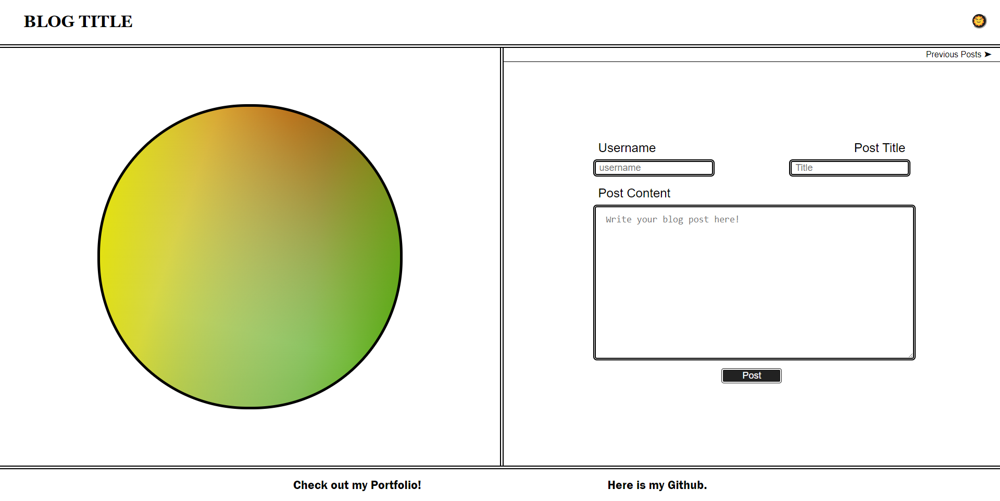
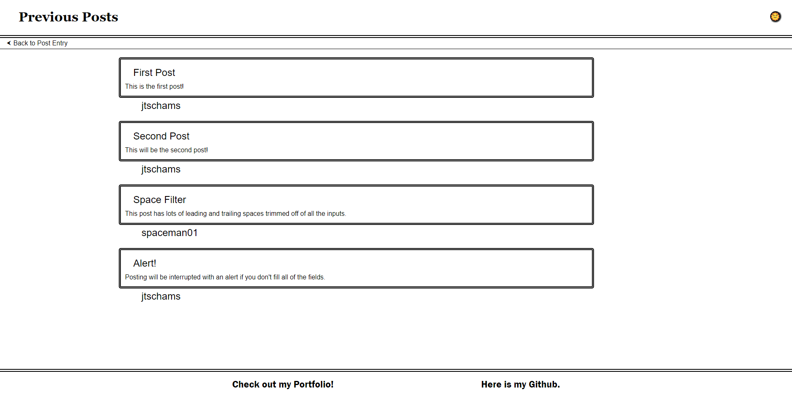
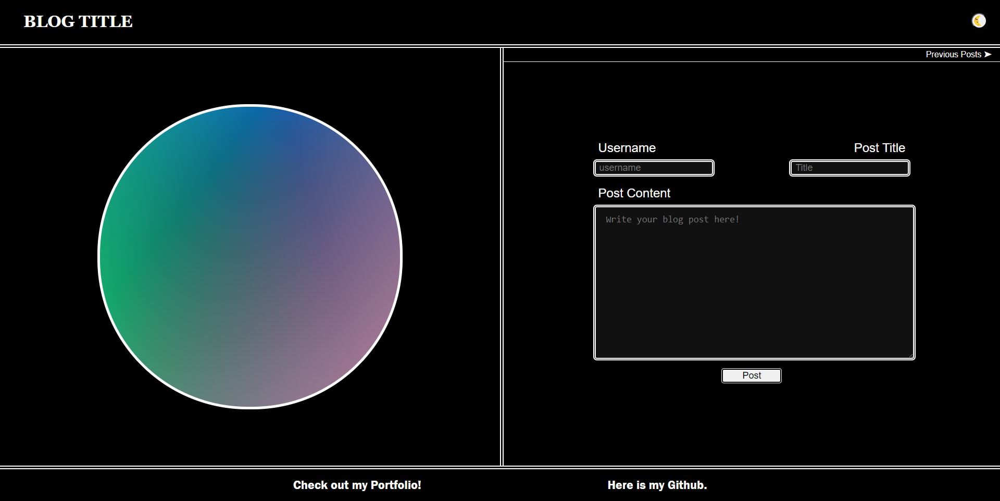

# README

## Description

This repository is made for the purpose of creating a blog that saves and displays posts via local storage.

## Visuals

## Usage

Enter your username, title, and post content to create a post.  Missing fields will trigger an alert to complete said field before post can be created.  Creating the post or clicking the Previous Posts link will take you to the blog page where previous posts can be viewed.  The Back to Post Entry link will take you back to the main page.  The button at the top right will toggle light mode and dark mode.

## Technologies Used

HTML 5, CSS 3, Javascript ES6+

## Links

[Page Link](https://jtschams.github.io/blog-site/)

[Repository link (Github)](https://github.com/jtschams/blog-site)

[Author Github Profile](https://github.com/jtschams)

## License

Please refer to LICENSE in repository

## Credits

For Reset CSS: \
http://meyerweb.com/eric/tools/css/reset/ \
v2.0 | 20110126 \
License: none (public domain)
